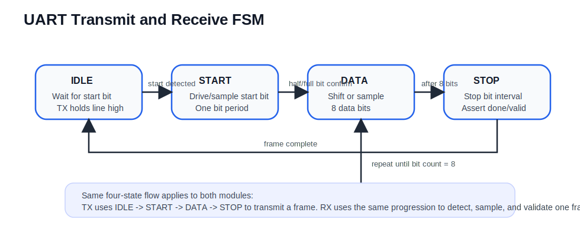

# UART Protocol Folder

## Purpose

This folder contains a simple UART transmitter, a UART receiver, a Nexys A7 top-level wrapper, a Vivado-friendly simulation testbench, and a protocol-specific XDC file.

The implementation targets a standard asynchronous serial frame:

- `1` start bit
- `8` data bits
- `1` stop bit
- no parity

The design is written in Verilog-2001 so it can be synthesized in AMD Vivado and simulated in Vivado XSIM.

## Files

- `uart_tx.v`
  UART transmitter FSM. It sends one byte LSB first at a baud rate set by `CLKS_PER_BIT`.
- `uart_rx.v`
  UART receiver FSM. It detects a start bit, samples in the middle of the bit period, and raises `data_valid` when one byte has been received.
- `uart_top.v`
  Nexys A7 wrapper. `sw[7:0]` is the transmit byte. `sw[15]` creates a transmit pulse.
- `uart_tb.v`
  Simulation testbench. It connects the transmitter to the receiver internally and checks that the received byte matches the transmitted byte.
- `uart_nexys_a7.xdc`
  Constraint file for this UART example.

## Hardware Connections

The top-level module in this folder is:

- `uart_top`

Board-level intent:

- `clk100`
  100 MHz board clock
- `sw[7:0]`
  transmit data byte
- `sw[15]`
  rising-edge transmit trigger
- `UART_TXD_IN`
  external RX input from the USB-UART interface
- `UART_RXD_OUT`
  external TX output to the USB-UART interface
- `led[7:0]`
  last received byte
- `led[8]`
  transmitter busy
- `led[9]`
  transmit complete pulse
- `led[10]`
  receiver valid pulse

## Verilog Structure

The UART design uses explicit state-machine coding in the same style commonly used in introductory HDL classes:

- sequential `always @(posedge clk or posedge rst)` blocks
- localparam-encoded states
- explicit bit counters and clock counters
- no SystemVerilog-only constructs

This keeps the code straightforward for Vivado synthesis and waveform debugging.

## FSM and ASM Chart

The UART transmitter and receiver both use the same four-state control pattern. The state chart below summarizes the flow used in `uart_tx.v` and `uart_rx.v`.

## Testbench Notes

The testbench uses:

- an `initial` clock generator
- an `initial` reset and stimulus block
- a direct loopback from TX to RX
- `$display` and `$finish` for pass/fail reporting

This style works cleanly in Vivado Simulator.

## Vivado Use

For simulation, add:

- `uart_tb.v`
- `uart_tx.v`
- `uart_rx.v`

For synthesis and implementation, add:

- `uart_top.v`
- `uart_tx.v`
- `uart_rx.v`
- `uart_nexys_a7.xdc`
